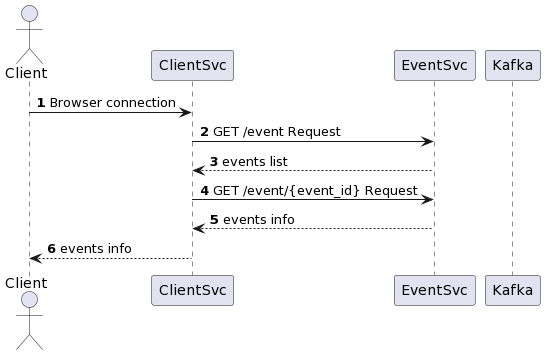
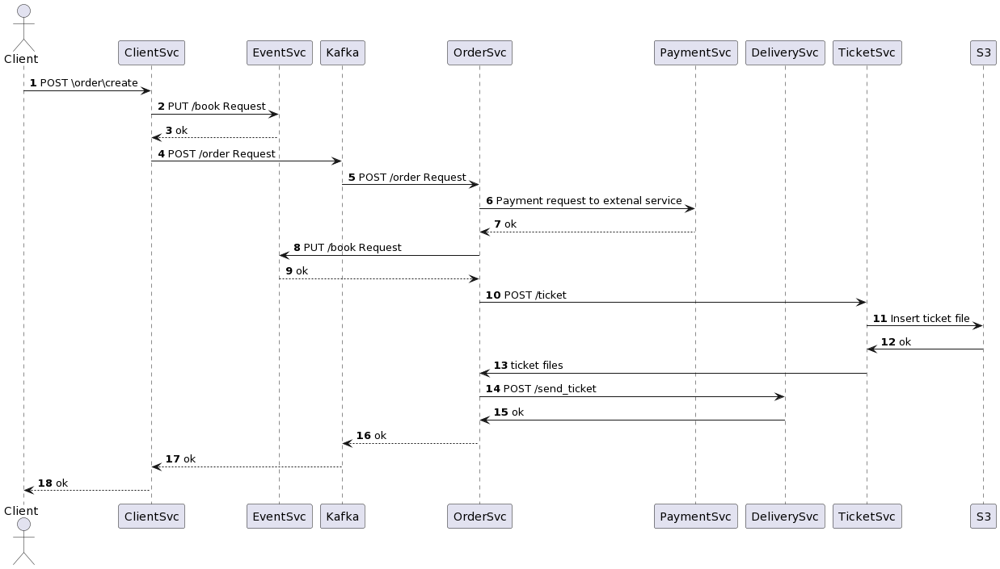

# Домашнее задание №5 "Архитектура проекта"
Предмет: Дизайн систем

Дедлайн: 19 декабря 23:59

## Задание

Возьмите любой кейс из [архитектурных ката](https://www.architecturalkatas.com/kata.html?kata=ConcertComparison.json) и спроектируйте его решение.

В решении необходимо предоставить:

- Пользовательские сценарии
- Общую схему взаимодействия сервисов.
- Для каждого сервиса опишите назначение сервиса и его зону ответственности.
  - Опишите контракты взаимодействия сервисов друг с другом.
  - Диаграмму контейнеров приложения на основе выбранной модели функциональной декомпозиции
- Декомпозицию слоя данных: какие данные в каких БД хранятся

## Проект "Сайт по продаже билетов"

[Ссылка на задание](https://www.architecturalkatas.com/kata.html?kata=ConcertComparison.json).

Сайт по продаже билетов с большим количеством запросов и высокой нагружкой нуждается в сервисе по продаже билетов. Пользователи: тысячи конкурирующих клиентов, достигает 10к запросов в моменты дропа билетов.

Требования:
- Обеспечить конкурентную работу сервиса
- Нельзя продать один билет дважды
- Покупатели должны видеть информацию об оставшихся местах

## Решение

Будем использовать микросервисную архитектуру, чтобы иметь возможность независимо управлять модулями приложения. Также,
такое решение позволит нам управлять нагрузкой на отдельные части приложения, без фиксации логики управления потоками внутри
сервисов.

### Пользовательские сценарии

Каждый сценарий подробно рассмотрен в блоке сценарией взаимодействия сервисов.

### Общая схема взаимодействия сервисов

#### ClientService

Основной сервис управления действиями клиента, в него приходят обращения из мобильного приложения, с веб-сайта,
из внешних подключений. Сервис обрабатывает запросы клиента и формирует ответы пользователю, в нем завязана логика 
упрвлением действий пользователя и формированием запросов на покупку билета, проверка на доступность билетов.
Сервис обращается к `AccountManagerService`, `EventService`, `TIcketService` и `OrderService` через Kafka.

#### AccountManagerService

Сервис отвечает за управление аккаунтами пользователей приложения, хранения основной информации о клиентах, 
параметров входа, связь клиентов с их заказами.

#### EventService

Сервиc отвечает за взаимодействия с мероприятиями, получение информации о событиях, о доступности мест. Сервис 
обращается только к БД.

#### TicketService

Сервис управления билетами клиентов, в нем создаются, удаляются билеты, идет общение с хранилищем S3. Сервис обращается
только к S3 и к БД.

#### OrderService 

Самое тяжелое место приложения, в нем происходит управление заказами клиентов, в частности, создание. Поскольку нагрузка
на сервис высокая, запросы к нему от клиента приходят через Kafka. Сервис обращается к внешней платежной системе 
`PaymentService`, `EventService`, `DeliveryService`, `TicketService` и БД.

#### PaymentService

Внешний сервис оплаты билетов, интеграция с платежной системой.

#### DeliveryService

Сервис, осуществляющий взаимодействие с клиентом посредством указанных им контактов: адрес почты, номер телефона.

### Сценарии взаимодействия сервисов

#### UC1. Регистрация клиента

Пользователь присылает запрос на создание аккаунта в клиентский сервис, тот обращается с запросом на внесение пользователя
в сервис `AccountManagerService`, если ошибок нет, клиент получает ответ со статусом ok.

#### UC2. Вход в личный кабинет

Пользователь присылает запрос на вход в существующий аккаунт в клиентский сервис, тот обращается с запросом на проверку
валидности введенных логина и пароля в сервис `AccountManagerService`, если ошибок нет, оба ответ на оба запроса ok.

#### UC5. Просмотр личного кабинета и заказов

Клиент посылает запрос на получение информации о своем личном кабинете, клиентский сервис обращается в `AccountManagerService`
за основной информацией о пользователе и его заказах, после чего клиентский сервис получает билеты из `TicketService`.

#### UC4. Получение информации о мероприятиях

Клиент посылает запрос в клиентский сервис на получение информации о доступных мероприятиях, возвращается список запросов,
клиент может выбрать конкретное мероприятие и получить информацию о нем и доступных местах.

#### UC10. Создание заказа

Данный сценарий является логическим продолжением UC4.

Выбрав нужное событие и билеты, клиент посылает запрос в `ClientService` о бронировании билета, `ClientService` через 
обращение `TicketService` в промечает, что билет забронирован, после чего направляет запрос в `OrderService` через Kafka,
тк в `OrderService` нужно посылать запросы порционно из-за потенциально большой нагрузки. Из `OrderService` высылается 
запрос в платежную систему с платежными данными клиента, после получения успешного ответа происходит PUT запрос в сервис 
событий, где место в событии промечается, как приобретенное. Приобретенные и забронированные места недоступны для бронирования
другими пользователями. Затем `OrderService` идет с запросом в сервис билетов, там создается билет с указанными данными
клиента и сохраняется в S3, файл с билетом отправляется клиенту на указанную почту через `DeliveryService`. Клиенту приходит
статус ok.

### Базы данных

#### AccountManagerDB

#### EventDB

#### TicketDB

#### OrderDB
