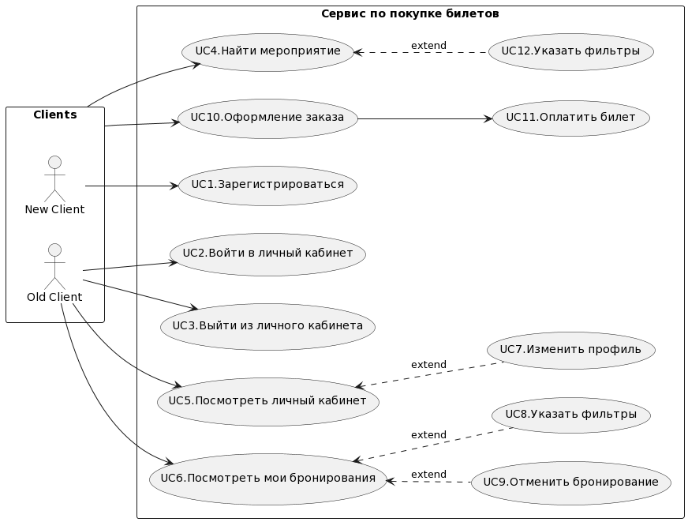

# Домашнее задание №5 "Архитектура проекта"
Предмет: Дизайн систем

Дедлайн: 19 декабря 23:59

## Задание

Возьмите любой кейс из [архитектурных ката](https://www.architecturalkatas.com/kata.html?kata=ConcertComparison.json) и спроектируйте его решение.

В решении необходимо предоставить:

- Пользовательские сценарии
- Общую схему взаимодействия сервисов.
- Для каждого сервиса опишите назначение сервиса и его зону ответственности.
  - Опишите контракты взаимодействия сервисов друг с другом.
  - Диаграмму контейнеров приложения на основе выбранной модели функциональной декомпозиции
- Декомпозицию слоя данных: какие данные в каких БД хранятся

## Проект "Сайт по продаже билетов"

[Ссылка на задание](https://www.architecturalkatas.com/kata.html?kata=ConcertComparison.json).

Сайт по продаже билетов с большим количеством запросов и высокой нагружкой нуждается в сервисе по продаже билетов. Пользователи: тысячи конкурирующих клиентов, достигает 10к запросов в моменты дропа билетов.

Требования:
- Обеспечить конкурентную работу сервиса
- Нельзя продать один билет дважды
- Покупатели должны видеть информацию об оставшихся местах

## Решение
### Пользовательские сценарии

Здесь будет таблица со всей хуйней

### Общая схема взаимодействия сервисов

#### Web

Сайт со списком мероприятий, основная страница содрежит каталог мероприятий и краткую информацию о них. 
Каждому мероприятию соответствует своя страница, на которой можно выбрать и приобрести билет. 
Также на сайте предумсмотрена авторизация в личный кабинет. Сайт обращается по API к сервисам AccountManagerService, EventService, OrderService.

#### AccountManagerService

Сервис отвечает за управление аккаунтами пользователей приложения, хранения основной информации о клиентах,
списке забронированных и купленных билетов. Сквозь него также проходит 

#### EventService

Сервиc отвечает за взаимодействия с мероприятиями, получение информации о событиях, о доступных местах.

#### OrderService 

Сервис отвечает за управление заказами клиентов.

#### TicketService

Сервис управления билетами клиентов, в нем создаются, удаляются билеты, идет общение с хранилищем S3.

#### PaymentService

Внешний сервис оплаты билетов, интеграция с платежной системой.

#### DeliveryService

Сервис, осуществляющий взаимодействие с клиентом посредством указанных им контактов: адрес почты, мобильный телефон.

### Сценарии взаимодействия сервисов

#### UC1. Регистрация клиента

#### UC2. Вход в личный кабинет

#### UC5. Просмотр личного кабинета и заказов

#### UC5. Поиск мероприятий и покупка билета

### Базы данных

#### AccountManagerDB

#### EventDB

#### TicketDB

#### OrderDB
